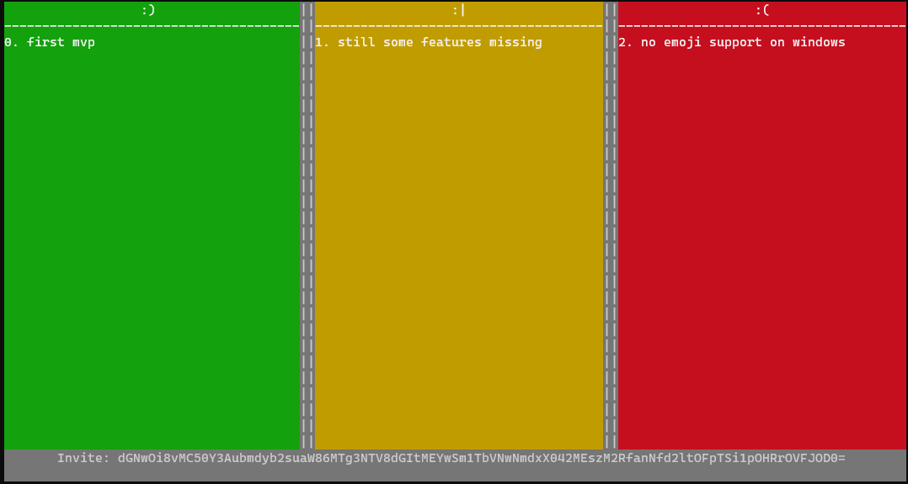

# Retro on the commandline

Retro-CLI uses ngrok to setup a local server and generate an invitation code for others to join.
Only the host needs an ngrok.com account.

## Features

* Host or join retro
* Connectin via ngrox.com
* End-to-End encryption




## Installation

### Requires Python 3.8+

```
brew install python
# or even better, use pyenv
brew install pyenv
pyenv install 3.9.0
```


### Install cli

```
pip install git+https://github.com/eruvanos/retro-cli.git
```

> This will also install ngrok on your path

## Usage

#### Start as host

Configure your NGrok auth token. (Register at https://ngrok.com to get it)
Starts the storage backend and generates an invitation code, which is shown in the console.

```

ngrok authtoken <auth token>

retro -s
```

#### Join a host


Starts the app and asks for the invitation code of the host.

```
retro
```


#### Shortcuts

* `CTRL + q` - Exit

#### Commands

##### Add a new item

You cann add items to the retro board by typing in your text, tusing a prefix to assign the item to a column.

Prefix:
- `+` Happy
- `.` Neutral 
- `-` Sad

##### Move an item

`mv <item id> <column prefix>`

##### Remove an item

`rm <item id>`


